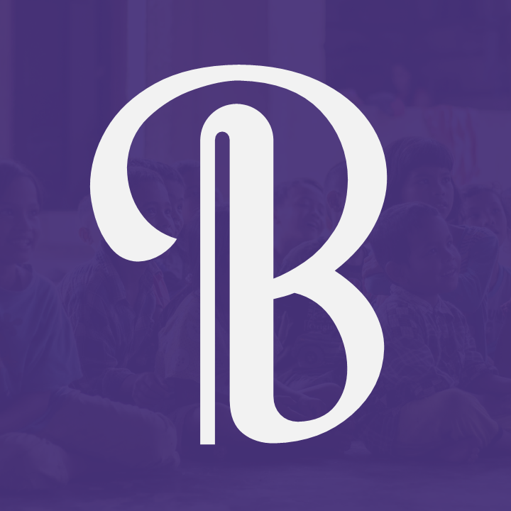
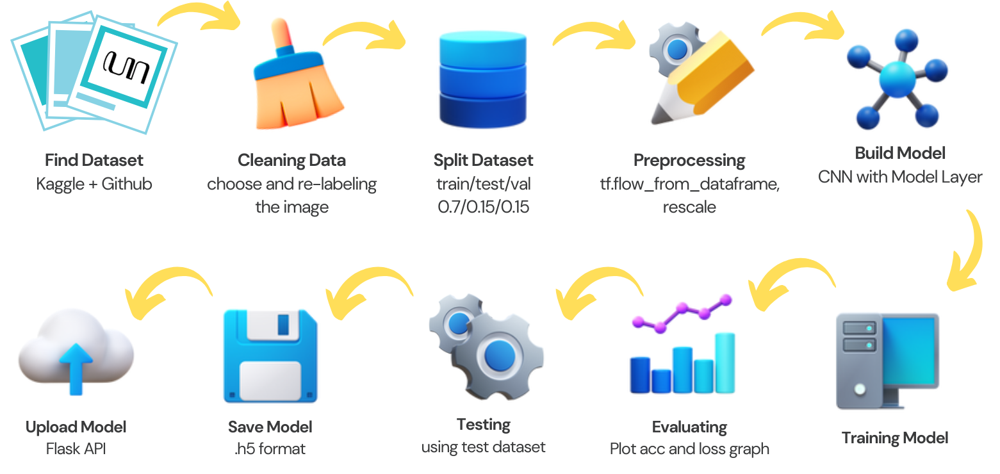

[![Contributors][contributors-shield]][contributors-url]

<!-- PROJECT LOGO -->
 

  
<h3 align="center">Machine Learning Center</h3>

<!-- ABOUT THE PROJECT -->

[![Tensorflow][tensorflow]][tensorflow-url] 
[![Keras][keras]][keras-url] 
[![OpenCV][opencv]][opencv-url] 

 

[![Machine Learning Workflow][workflow]](https://github.com/vesouveeous/basuwara/blob/main/Machine%20Learning/images/workflow.png)

 

The machine learning workflow begins with collecting and combining the Sundanese, Javanese, and Balinese script dataset. Then, the data is split into training, validation, and testing sets. Afterwards, data augmentation is performed. The model itself is a Convolutional Neural Network (CNN) model, consisting of a few convolution layers, a flatten layer, and some dense layer in the end. The trained model is saved in a .h5 format, where Flask API is used to deploy it.

[contributors-shield]: https://img.shields.io/github/contributors/vesouveeous/basuwara.svg?style=for-the-badge
[contributors-url]: https://github.com/vesouveeous/basuwara/graphs/contributors

[tensorflow]: https://img.shields.io/badge/TensorFlow-%23FF6F00.svg?style=for-the-badge&logo=TensorFlow&logoColor=white
[tensorflow-url]: https://tensorflow.org/
[keras]: https://img.shields.io/badge/Keras-%23D00000.svg?style=for-the-badge&logo=Keras&logoColor=white
[keras-url]: https://keras.io/
[opencv]: https://img.shields.io/badge/opencv-%23white.svg?style=for-the-badge&logo=opencv&logoColor=white
[opencv-url]: https://opencv.org/
[workflow]: images/workflow.png
